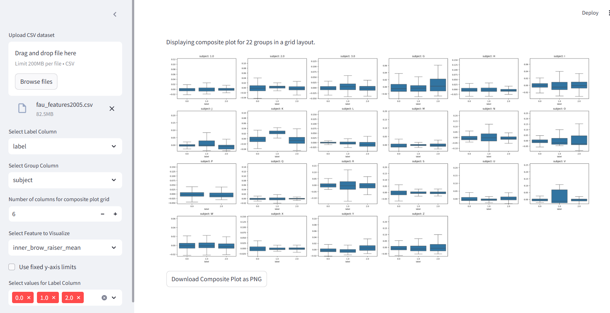

# Grid boxplot App

This repository contains a Streamlit application that lets you dynamically visualize composite boxplots from your CSV dataset. The app offers a user-friendly interface to upload data, select columns for grouping and labeling, adjust the composite plot grid, and download the generated plot as a PNG image.



## Features

- **Dynamic CSV Upload:** Easily upload your own CSV dataset.
- **Interactive Column Selection:** Choose the label column and group column (e.g., "subject") using dropdowns.
- **Custom Grid Layout:** Specify the number of columns for arranging subplots in the composite plot.
- **Visualization Options:** Select a feature to visualize and adjust y-axis limits if needed.
- **Download Plot:** Save the composite plot as a PNG file with a single click.

## Installation

1. **Clone the Repository:**

   ```bash
   git clone https://github.com/smajidhosseini/Grid-Dashboard
   cd Grid-Dashboard

2. **Set Up a Virtual Environment (optional but recommended):**
    ```bash
    python -m venv venv
    source venv/bin/activate  # On Windows: venv\Scripts\activate
3. **Install the Dependencies:**
    ```bash
    pip install -r requirements.txt

## Running the Application
1. **Launch the application with Streamlit by running:**

    ```bash
    streamlit run auto_grid.py

This will open the app in your default web browser.

## Usage
1. **Upload a CSV File: Use the sidebar file uploader to load your dataset.**
2. **Select Columns: Choose the label column and group column (e.g., "subject") via the dropdown menus.**
3. **Adjust Grid Layout: Set the number of columns for the composite plot grid.**
4. **Visualize Data: Select the feature to visualize from your dataset.**
5. **Download Plot: After the composite plot is generated, click the download button below the image to save it as a PNG file.**
## Dependencies
The application requires the following Python libraries:

1. **Streamlit**
2. **Pandas**
3. **Seaborn**
4. **Matplotlib**
   
For exact version details, please refer to the requirements.txt file.

## License
This project is licensed under the MIT License.

## Acknowledgements
Developed with Streamlit. Contributions and feedback are welcome!

